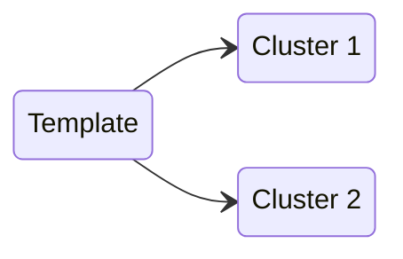
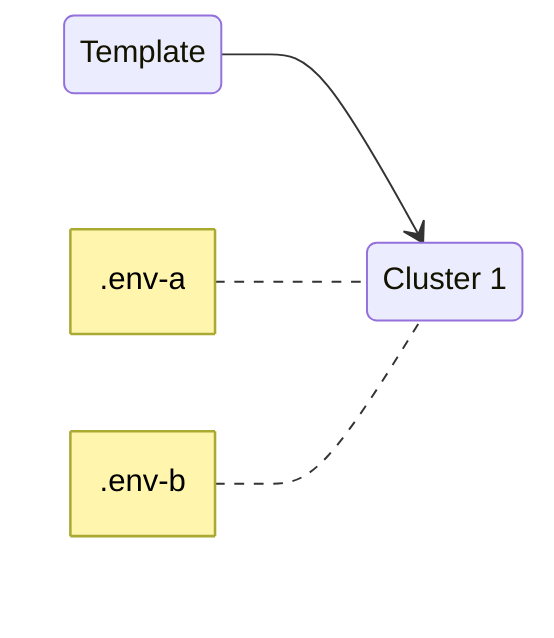
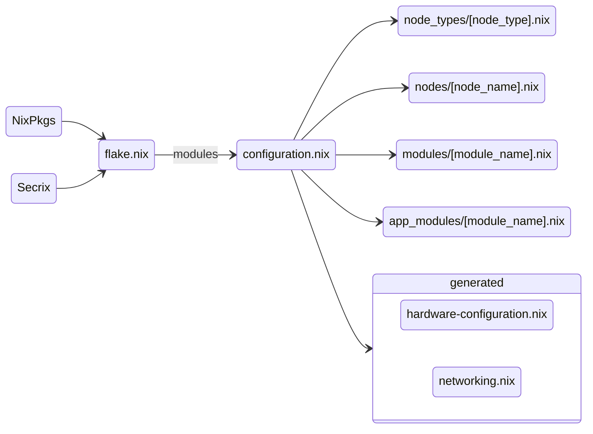
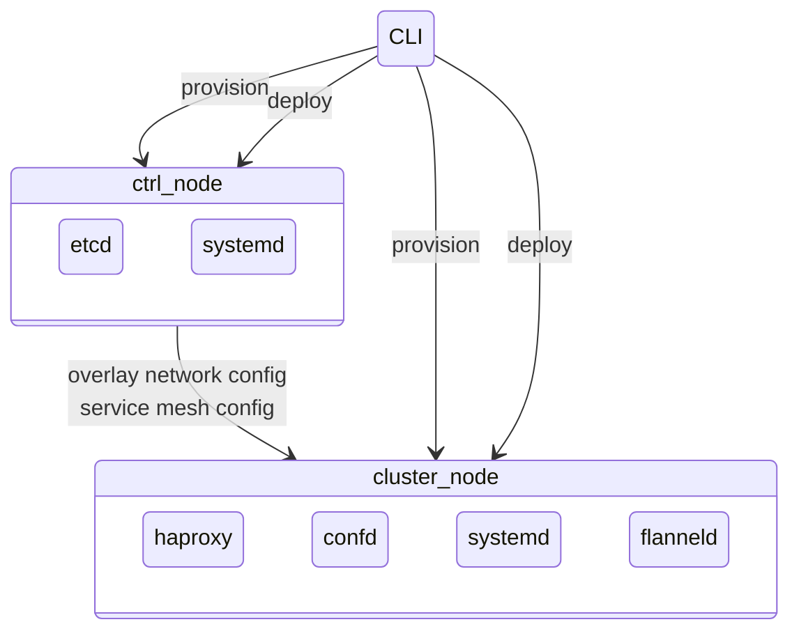
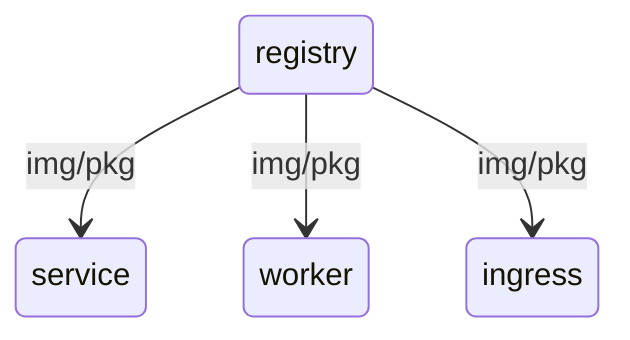
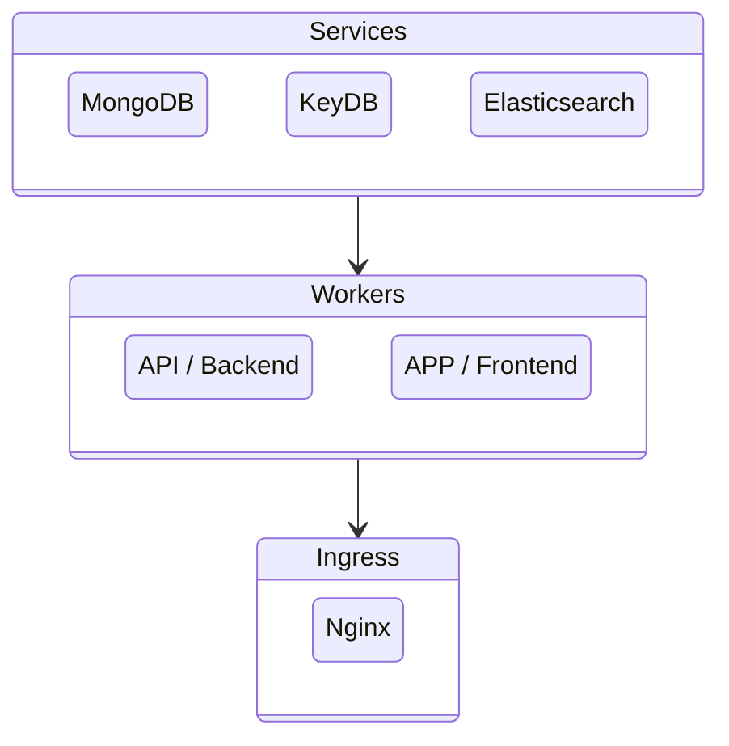
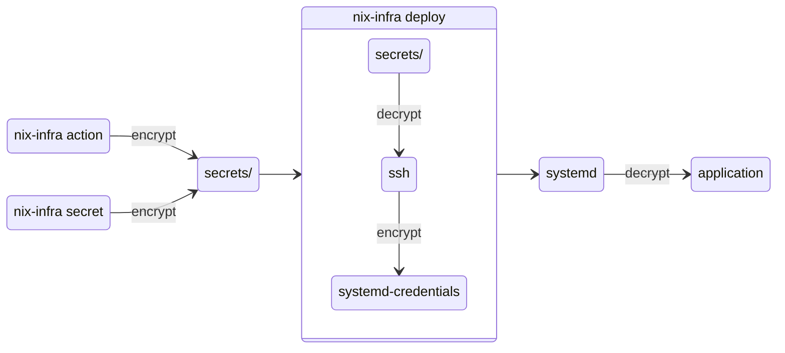

# nix-infra

There is a future for private PaaS-solutions in a world where privacy and cost-control are primary concerns. We just needs to build it on the right foundation.

Create a private PaaS on Hetzner Cloud in minutes using nix-infra. Leverage **NixOS** and **Nix Packages** to build a reproducable and auditable private cloud for your projects.

Why did I build this? I wanted to test the limits of NixOS when it comes to maintainability and real world use.

- low and predictable cost -- runs on Hetzner Cloud
- reproducable and auditable -- 100% configuration in code
- privacy -- all data within your private walled garden
- easy to debug -- zero blackbox services
- extendable -- install anything than runs on NixOS or as an OCI-container
- customise in any way you like

You can easily share and extend modules to build the perfect private PaaS.

Low system requirements for each cluster node makes virtual machine isolation per service/application cost effective.

Features:
- runs NixOS as host OS
- uses Systemd credentials to secure secrets
- fault tolerant service mesh (with HAProxy + Etcd + Confd)
- private encrypted overlay network (with flanneld + wireguard)
- supports provisioning nodes in multiple data centers
- run apps in OCI-containers with podman

Limitations:
- NixOS doesn't support SELinux
  - UPDATE: https://tristanxr.com/post/selinux-on-nixos/
- nix-infra currently only supports Hetzner Cloud
- the code is the primary documentation

Room for improvement:
- hardening with AppArmor [major]
- encryption of config folder at rest [medium]
- rotating secrets [medium]
- virtual tpm for systemd-credentials (not supported by Hetzner cloud)
- visualise cluster health [major]

Apple discusses privacy in a post about [Private Cloud Compute](https://security.apple.com/blog/private-cloud-compute/).

## Getting Started

You are recommended to install Nix on your machine and work in a nix-shell. If you don't know how to install Nix, try the [Determinate Systems Nix installer](https://github.com/DeterminateSystems/nix-installer), it has uninstall support and automatic garbage collection.

1. [Download](https://github.com/jhsware/nix-infra/releases) and install the nix-infra binary

Clone this repo and run `nix-shell` to ensure you get [the right version](https://github.com/jhsware/nix-infra/blob/main/nix/hcloud.nix) of the `hcloud` tool.


### Option 1: Create a cluster setup
2. Use the [nix-infra-test](https://github.com/jhsware/nix-infra-test) or [nix-infra-ha-cluster](https://github.com/jhsware/nix-infra-ha-cluster) cluster templates

### Option 2: Create a fleet of standalone machines
2. Use the [nix-infra-test-machine](https://github.com/jhsware/nix-infra-test-machine) standalone machines template (contains a cli-script as a starter for you to customise)

You will find instructions in the each repo. Basically you will download and run a test script that automates the installation of the cluster. Or, you can clone the repo and create your own bespoke automation scripts inspired by the test script.

### Test Script Options

To build without immediately tearing down the cluster:

```sh
$ ./test-nix-infra-with-apps.sh --env=.env --no-teardown
# -- or --
$ ./test-nix-infra-ha-base.sh --env=.env --no-teardown
```

Useful commands to explore the running test cluster (check the bash script for more):

```sh
$ ./test-nix-infra-with-apps.sh etcd --env=.env "get /cluster --prefix"
$ ./test-nix-infra-with-apps.sh cmd --env=.env --target=ingress001 "uptime"
$ ./test-nix-infra-with-apps.sh ssh --env=.env ingress001
# -- or --
$ ./test-nix-infra-ha-base.sh etcd --env=.env "get /cluster --prefix"
$ ./test-nix-infra-ha-base.sh cmd --env=.env --target=ingress001 "uptime"
$ ./test-nix-infra-ha-base.sh ssh --env=.env ingress001

```

To tear down the cluster:

```sh
$ ./test-nix-infra-with-apps.sh --env=.env teardown
# -- or --
$ ./test-nix-infra-ha-base.sh --env=.env teardown
```

## Build `nix-infra` From Source
1. Install nix to build nix-infra (choose one)
- https://nixos.org/download/
- https://github.com/DeterminateSystems/nix-installer (supports uninstall)

2. Clone the repo
```sh
$ git clone git@github.com:jhsware/nix-infra.git
```

3. Build nix-infra using the build script
```sh
$ cd nix-infra; ./build.sh
# ouput: bin/nix-infra
```

## Creating a Cluster
Configuration of your cluster using the **Nix** language.

Add remote actions written in **Bash** that can be run on cluster nodes.

1. Clone a cluster template
2. Run `nix-infra init` to create the cluster configuration folder
3. Create a `.env` file
4. Add the created ssh-key to the ssh agent (probably: `ssh-add`)
5. Provision nodes `nix-infra provision`
6. Initialise control plane `nix-infra init-ctrl``
7. Initialise cluster nodes `nix-infra init-node`
8. Configure apps (apps consist of app_module and node specific configuration)
9. Deploy apps `nix-infra deploy`

### Cluster Setup
To create similar clusters you create a cluster template and fork it for each cluster.


To share apps you copy them to your cluster repo.


To create an exact copy of cluster, use the same cluster repo but different .env-files.


### Cluster Configuration
The configuration files are related according to the diagram below. These are the files you would normally configure
once you cluster is up and running:

- `nodes/[node_name].nix` -- install and configure apps on each node
- `app_modules/[module_name].nix` -- configure apps available on the cluster

When you add new files to app_modules you need to import them in `app_modules/default.nix`.



### Cluster Provisioning

Provisioning of nodes, deployment of configurations and container images is done through the nix-infra CLI. The overlay network and service mesh is configured via the etcd-database of the control plane (ctrl).



### Nix Packages and Container Images
The registry node contains a package cache and registry which allows you to
provide private packages and caching.

The registry node also contains a container image registry where you push
your private application images.



### Service Overview
The cluster has a simple topology with three layers. Only the ingress layer
is exposed to the outside world.



#### Services
Stateful services such as DBs run on the service nodes.

#### Workers
Worker nodes that run your stateless application containers.

#### Ingress
The ingress node exposes the cluster to the internet via an Nginx reverse proxy.

## Development Notes
Testing:
```sh
scripts/end-to-end-tests/test-nix-infra-ha-cluster.sh --env=./.env
scripts/end-to-end-tests/test-nix-infra-test.sh --env=./.env
```

## etcd data model

```JavaScript
/cluster/frontends
    [app_name]/
      instances/
        [node_name]={
          "node": "[node_name]",
          "ipv4": "123.23.23.0",
          "port": 123
        }
      meta_data={
        publish: { ”port”: 5001 } // Used by HA proxy to expose service on worker nodes
        env_prefix: "[PREFIX]"
        env: { "PROTOCOL", "HOST", "PORT", "PATH" }
      }
/cluster/backends
    [app_name]/
      instances/
        [node_name]={
          "node": "[node_name]",
          "ipv4": "123.23.23.0",
          "port": 123
        }
      meta_data={
        publish: { ”port”: 5001 } // Used by HA proxy to expose service on worker nodes
        env_prefix: "[PREFIX]"
        env: { "PROTOCOL", "HOST", "PORT", "PATH" }
      }
/cluster/services
    [app_name]/
      instances/
        [node_name]={
          "node": "[node_name]",
          "ipv4": "123.23.23.0",
          "port": 123
        }
      meta_data={
        publish: { ”port”: 5001 } // Used by HA proxy to expose service on worker nodes
        env_prefix: "[PREFIX]"
        env: { "PROTOCOL", "HOST", "PORT", "PATH" }
      }

/cluster/nodes
    [node_name]={
      "name": "[node_name]",
      "ipv4": "123.23.23.9",
      "services": ["services", "frontends", "backends"] // Service types to access
    }
```
### Node Lifecycle

1. Provision node
2. Initialise node
3. Resister node
4. Unregister node
5. Destroy node

### App Lifecycle

CONSIDER: We might want to provide some kind of CI/CD-pipeline

1. Register app
2. Deploy app to node
3. Register app instance
4. Unregister app instance
5. Remove app from node
6. Unregister app

## Secrets

Secrets are created either:
- by storing the result of an action (i.e. when you create a user in a db), or
- by explicitly storing a provided secret (i.e. an external API-key)

```sh
nix-infra [...] action [...] --store-as-secret="[secret-name]"
nix-infra [...] store-secret [...] --secret="[your-secret]" --store-as-secret="[secret-name]"
```




## Internal Developer Notes

### Releasing
1. Update version in pubspec.yaml

2. Build macOS binary

```sh
./build.sh build-macos --env=.env
```

3. Package and notarise macOS binary

4. Run build workflow to create draft release with Linux binary

5. Add macOS binary to release

6. Add release notes

7. Publish release

### NOTES:

TODO: Investigate secret rotation
  - https://partial.solutions/2024/understanding-systemd-credentials.html
TODO: Automated builds
  - https://blog.thestateofme.com/2023/05/17/multi-architecture-automated-builds-for-dart-binaries/

TODO: Font
  - https://www.dafont.com/aristotelica.font?text=nix-infra
  - https://fonts.google.com/specimen/Comfortaa?preview.text=nix-infra&categoryFilters=Sans+Serif:%2FSans%2FRounded

DONE: Investigate using systemd credentials 
  - https://dee.underscore.world/blog/systemd-credentials-nixos-containers/

INVESTIGATE: Securing systemd services
  - https://documentation.suse.com/smart/security/pdf/systemd-securing_en.pdf

INVESTIGATE: Tuning kernel and HAProxy
  - https://medium.com/@pawilon/tuning-your-linux-kernel-and-haproxy-instance-for-high-loads-1a2105ea553e

DONE: Investigate Nixos secrets management
  - https://nixos.wiki/wiki/Comparison_of_secret_managing_schemes
  - secrix appears to have systemd integration

DONE: Investigate using agenix for secrets
  - https://nixos.wiki/wiki/Agenix
  - https://github.com/ryantm/agenix
  - https://github.com/FiloSottile/age
