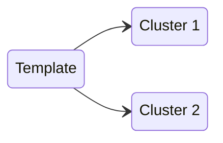
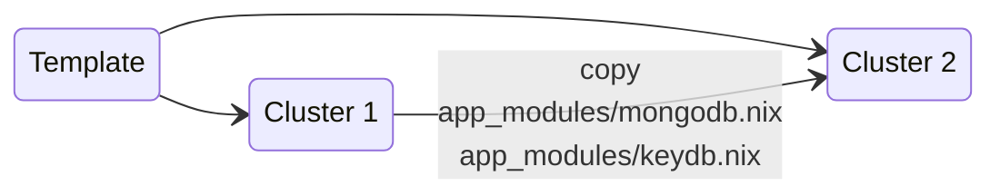
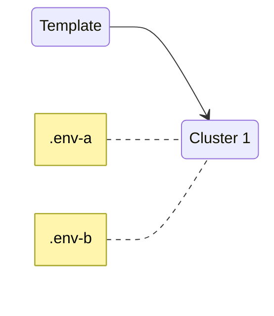
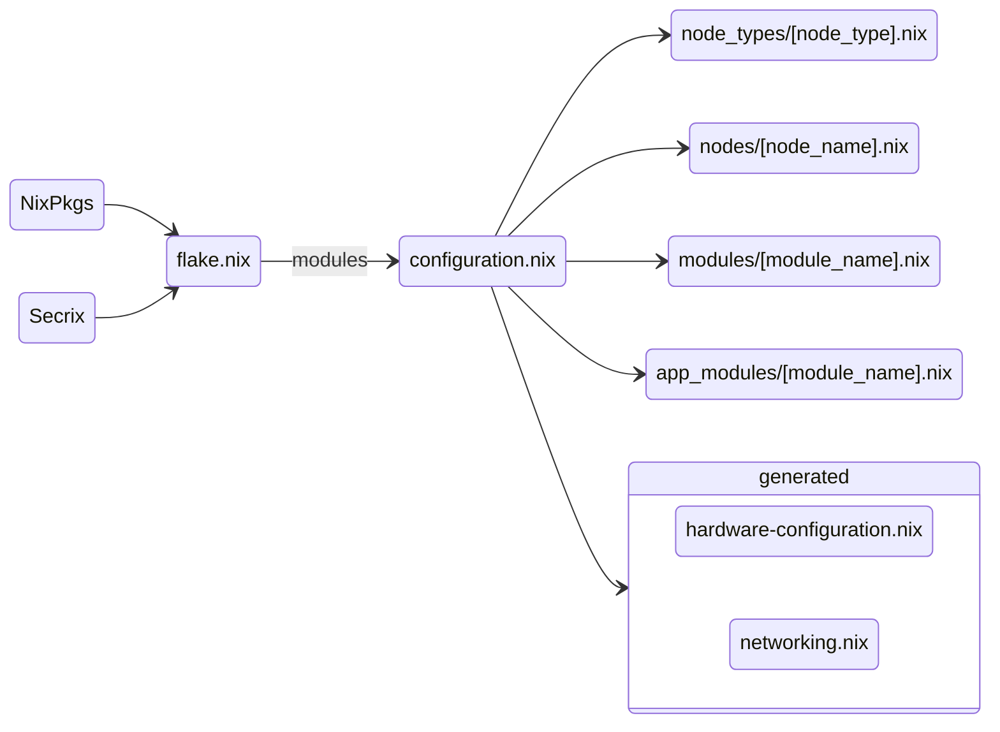
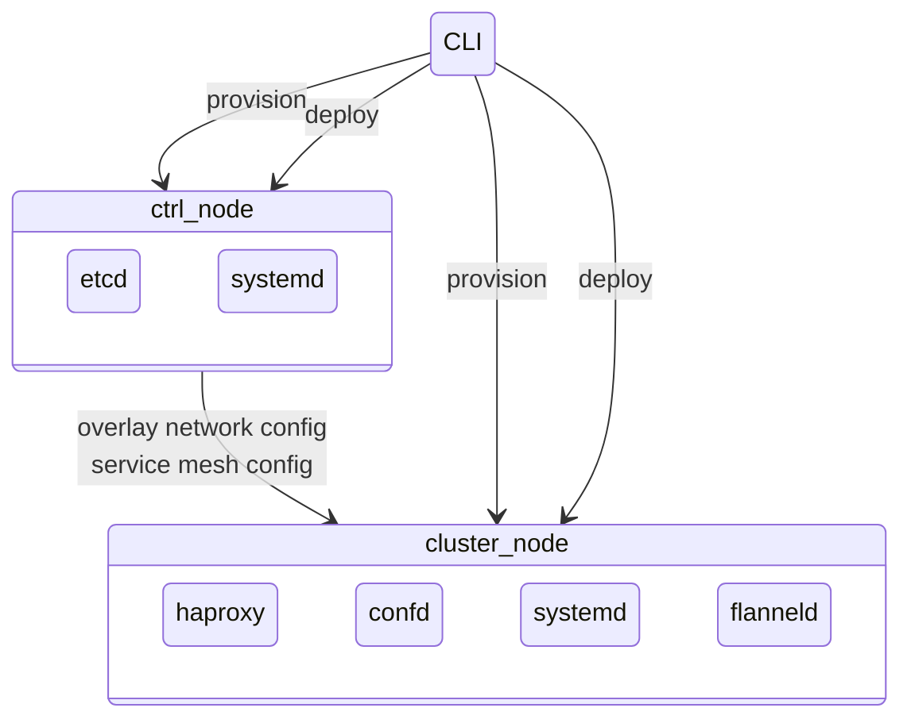
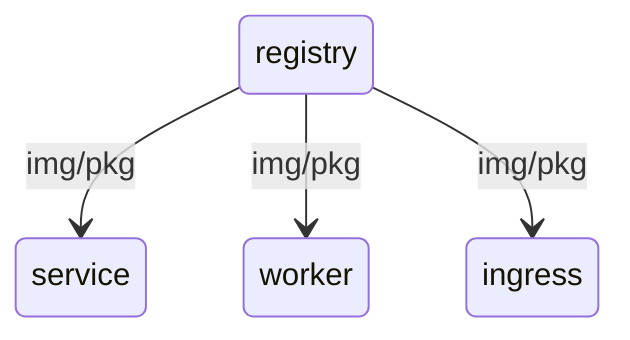
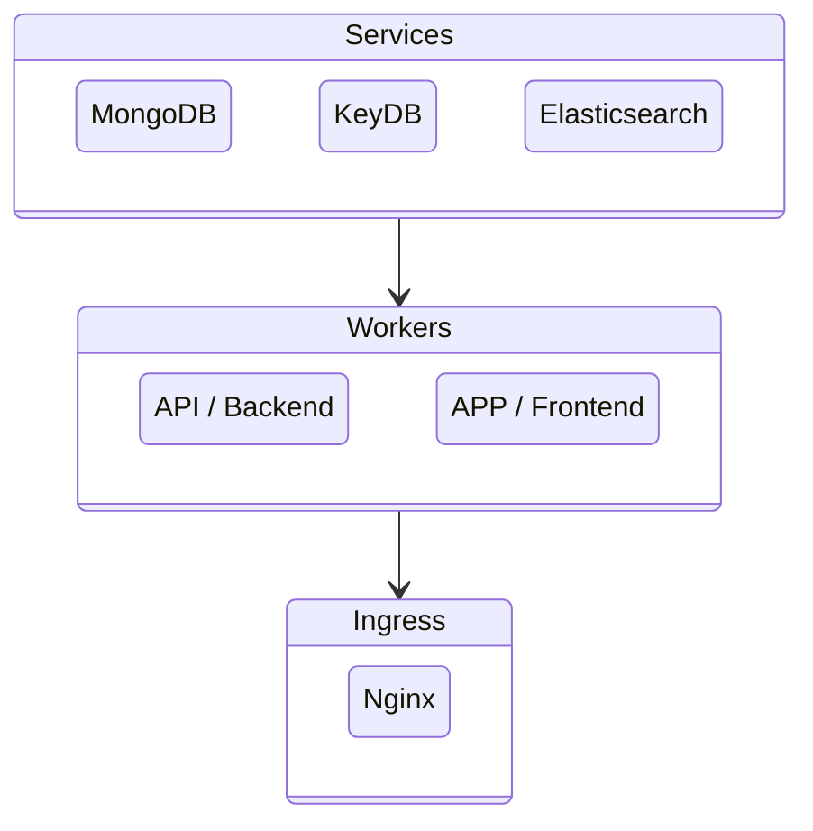
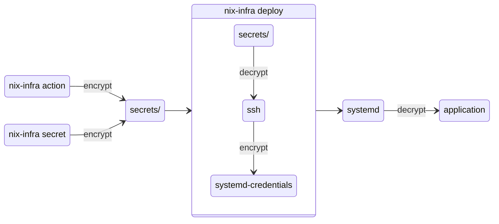

# nix-infra

Create a private PaaS on Hetzner Cloud or your own servers in minutes. Leverage **NixOS** and **Nix Packages** to build a reproducible and auditable private cloud for your projects.

**Why nix-infra?** You want to move away from click-ops and embrace infrastructure-as-code and reproducability. You want to avoid vendor lock-in and unpredictable cloud bills. There is a future for private PaaS solutions in a world where privacy and cost control are primary concerns, we just need to build it on a robust foundation.

> **Experimental:** nix-infra now includes [MCP server support](#mcp-server-experimental) for AI-assisted infrastructure management. Query node status, inspect logs, and manage your fleet through natural language conversations with Claude or other MCP-compatible AI assistants. This is an early experiment in making Linux system administration more accessible and efficient.

**Benefits:**

- **Low and predictable cost** — can provision from scratch on Hetzner Cloud or deploy to your existing servers using ssh 
- **Reproducible and auditable** — 100% configuration in code
- **Privacy** — all data within your private walled garden
- **Easy to debug** — zero blackbox services
- **Extensible** — install anything that runs on NixOS or as an OCI container
- **Customisable** — modify and share modules to build your perfect private PaaS

Low system requirements for each cluster node make virtual machine isolation per service/application cost-effective.

**Features:**

- NixOS as host OS
- Systemd credentials for secure secrets management
- Fault-tolerant service mesh (HAProxy + etcd + confd)
- Private encrypted overlay network (Flanneld + WireGuard)
- Multi-datacenter node provisioning
- OCI container support with Podman

**Limitations:**

- NixOS doesn't officially support SELinux (though [experimental work is underway](https://tristanxr.com/post/selinux-on-nixos/))
- The code is the primary documentation

**Room for improvement:**

- Hardening with AppArmor [major]
- Encryption of config folder at rest [medium]
- Rotating secrets [medium]
- Virtual TPM for systemd-credentials (not supported by Hetzner Cloud)
- Cluster health visualisation [major]

Apple discusses privacy in a post about [Private Cloud Compute](https://security.apple.com/blog/private-cloud-compute/).
Discussions on [boot time integrity checks](https://discourse.nixos.org/t/boot-time-integrity-checks-for-the-nix-store/36793).

## Getting Started

### Prerequisites

[Download](https://github.com/jhsware/nix-infra/releases) and install the nix-infra binary.

You need SSH and OpenSSL installed.

### Choose Your Setup

**Option 1: High-availability cluster**

Use the [nix-infra-ha-cluster](https://github.com/jhsware/nix-infra-ha-cluster) template for a fault-tolerant multi-node cluster with service mesh and overlay networking.

**Option 2: Fleet of standalone machines**

Use the [nix-infra-machine](https://github.com/jhsware/nix-infra-machine) template for managing individual machines or fleets without cluster orchestration.

Each repo contains detailed instructions. You can either run the provided test script to automate installation, or clone the repo and create custom automation scripts.

## Infrastructure Providers

nix-infra supports two infrastructure providers:

### Hetzner Cloud (Default)

The default provider creates and manages servers on Hetzner Cloud. Set your API token in the `.env` file:

```sh
HCLOUD_TOKEN=your-hetzner-api-token
```

With Hetzner Cloud, nix-infra can:
- Provision new servers
- Destroy servers
- Use placement groups for high availability
- Manage SSH keys in the cloud

### Self-Hosted Servers

Note: your host machine must run a **Debian-based distro or NixOS**. Currently RHEL-based distros fail to convert to Nixos.

For existing servers, bare metal machines, or other cloud providers, use the self-hosting provider. Create a `servers.yaml` file in your working directory:

```yaml
servers:
  web-server-1:
    ip: 192.168.1.10
    ssh_key: ./ssh/web-server-key
    description: Primary web server # Optional
    username: admin  # Optional, defaults to 'root'
    metadata:        # Optional, for your own use
      location: rack-1
      environment: production

  db-server-1:
    ip: 192.168.1.20
    ssh_key: /absolute/path/to/db-key
    description: Primary database server

  worker-1:
    ip: 10.0.0.5
    ssh_key: ./ssh/worker-key
```

**Required fields:**
- `ip` — Server IP address
- `ssh_key` — Path to SSH private key (relative to working directory or absolute)

**Optional fields:**
- `description` — Human-readable server description
- `username` — SSH username (defaults to `root`)
- `metadata` — Key-value pairs for your own organisation

**Provider auto-detection:**

nix-infra automatically selects the provider based on your configuration:

1. If `servers.yaml` exists → Self-Hosting provider
2. If `HCLOUD_TOKEN` is set → Hetzner Cloud provider
3. Otherwise → Error

**Limitations of self-hosted servers:**

The self-hosting provider does not support:
- creating servers during the provisioning phase
- `destroy` command (remove servers manually from `servers.yaml`)
- placement groups, since the servers have already been created

All other commands work normally: `init-node`, `deploy`, `ssh`, `cmd`, `action`, etc.

Note: the provision command should still be used and will convert a linux server to NixOS if it is running another distribution.

**IMPORTANT:** the nix-infra SSH library doesn't support the NixOS default encryption algorithms, make sure you update configuration.nix (or similar) with:

```yaml
services.openssh.settings.Macs = [
    "hmac-sha2-512-etm@openssh.com"
    "hmac-sha2-512" # Required for dartssh
    "hmac-sha2-256-etm@openssh.com"
    "hmac-sha2-256" # Required for dartssh
    "umac-128-etm@openssh.com"
  ];
```

**Mixed environments:**

You can migrate between providers or use self-hosted servers alongside Hetzner Cloud by maintaining both configurations. The provider is selected per-project based on the presence of `servers.yaml`.

## Building From Source

1. Install Nix (choose one):
   - https://nixos.org/download/
   - https://github.com/DeterminateSystems/nix-installer (supports uninstall)

2. Clone the repo:
```sh
git clone git@github.com:jhsware/nix-infra.git
```

3. Build using the build script (requires Dart, you can use `nix-shell -p dart`):
```sh
cd nix-infra && ./build.sh
# output: bin/nix-infra
```

## Creating a Cluster

Configure your cluster using the **Nix** language. Add remote actions written in **Bash** that can be run on cluster nodes.

### Quick Start

1. Clone a cluster template
2. Run `nix-infra init` to create the cluster configuration folder
3. Create a `.env` file with your Hetzner API token
4. Add the created SSH key to the ssh agent (`ssh-add`)
5. Provision nodes: `nix-infra provision`
6. Initialise control plane: `nix-infra init-ctrl`
7. Initialise cluster nodes: `nix-infra init-node`
8. Configure apps (apps consist of app_module and node-specific configuration)
9. Deploy apps: `nix-infra deploy`

### Cluster Setup Patterns

**Fork a template for each cluster:**



**Share apps between clusters by copying modules:**



**Create exact copies using the same repo with different .env files:**



### Configuration Files

The main configuration files you'll work with once your cluster is running:

- `nodes/[node_name].nix` — install and configure apps on each node
- `app_modules/[module_name].nix` — define apps available on the cluster

When you add new files to app_modules, import them in `app_modules/default.nix`.



### Cluster Provisioning

Node provisioning, configuration deployment, and container image management are handled through the nix-infra CLI. The overlay network and service mesh are configured via the etcd database on the control plane.



### Package Cache and Container Registry

The registry node contains a package cache and container image registry for distributing private packages and application images.



### Service Topology

The cluster has three layers. Only the ingress layer is exposed to the outside world.



**Services:** Stateful services such as databases run on service nodes.

**Workers:** Stateless application containers run on worker nodes.

**Ingress:** The ingress node exposes the cluster to the internet via an Nginx reverse proxy.

## MCP Server (Experimental)

nix-infra includes experimental [Model Context Protocol (MCP)](https://modelcontextprotocol.io/) servers that enable AI assistants like Claude to query and manage your infrastructure through natural conversation.

The vision is to provide an assistant that is more natural and efficient to use than complex GUI environments, while leveraging well-known Linux system administration tools available on the server by default. Instead of memorising command syntax or navigating dashboards, you can ask questions like "What's the health status of my service nodes?" or "Show me the recent logs for nginx".

### Three MCP Servers

- **nix-infra-cluster-mcp** — For HA clusters with etcd control plane
- **nix-infra-machine-mcp** — For standalone machines or fleets
- **nix-infra-dev-mcp** — For project configuration development and testing

### Available Tools

nix-infra provides two types of MCP servers with different purposes:

- **Infrastructure Management MCPs** (cluster-mcp, machine-mcp) — Query and monitor production infrastructure
- **Development MCP** (dev-mcp) — Assist with project configuration, testing, and app module development

#### Infrastructure Management MCPs

These MCPs enable AI assistants to query and monitor your running infrastructure without making modifications. They're designed for production environments where you want visibility without risk of accidental changes.

| Tool | Description | Cluster | Machine |
|------|-------------|:-------:|:-------:|
| `list-available-nodes` | List all nodes with ID, name, and IP | ✓ | ✓ |
| `system-stats` | Query system health, disk I/O, memory, network, and processes | ✓ | ✓ |
| `systemctl` | Query systemd unit status (read-only) | ✓ | ✓ |
| `journalctl` | Query systemd journal logs (read-only) | ✓ | ✓ |
| `remote-command` | Execute whitelisted commands over SSH | ✓ | ✓ |
| `configuration-files` | Read local configuration files | ✓ | ✓ |
| `etcd` | Query the etcd control plane (read-only) | ✓ | — |

#### Development MCP (nix-infra-dev-mcp)

The development MCP provides AI-assisted project configuration and testing capabilities. Unlike infrastructure MCPs, this MCP can modify files and manage test environments.

| Tool | Description |
|------|-------------|
| `read-project-files` | Read configuration files, app modules, and test definitions |
| `edit-app-module-files` | Modify files in the `app_modules` directory with AI assistance |
| `test-runner` | Run tests on existing test cluster and iterate on results |
| `test-environment` | Manage test cluster lifecycle (create, reset, teardown) |

### nix-infra-dev-mcp: Project Configuration Assistant

The dev MCP is designed for developers working on cluster configurations and app modules. It enables AI assistants to help with project development by:

- **Reading project files** — Access configuration files, app modules, and test definitions
- **Editing app modules** — Modify files in the `app_modules` directory with AI assistance
- **Running tests** — Execute tests on your test cluster and iterate on results
- **Managing test environments** — Create, reset, and teardown test clusters

This MCP is particularly useful when:
- Developing new app modules or services
- Debugging configuration issues
- Writing and running integration tests
- Refactoring cluster configurations

The dev MCP has restricted filesystem access limited to project directories like `__test__`, `app_modules`, `modules`, and `node_types`, ensuring safe AI-assisted development.

### Safety Measures

The MCP servers implement several layers of protection:

- **Command parsing and validation** — All commands are parsed and inspected before execution
- **Read-only restrictions** — Tools like `systemctl`, `journalctl`, and `etcd` only allow read operations
- **Whitelists and blacklists** — Remote commands are filtered against allowed/blocked command lists
- **Path restrictions** — Filesystem operations are confined to the project directory with no absolute paths or hidden files

### Security Considerations

> ⚠️ **Be mindful of prompt injection.** The MCP executes shell commands on your infrastructure. While safety measures are in place, this is inherently a challenging security problem.
>
> **Assume you can destroy your environment at any time and prepare accordingly.** Maintain backups and ensure you can restore your infrastructure.

### Usage

The cluster templates include a `./cli claude` command that launches Claude with the appropriate MCP server configured:

- **For HA clusters** (nix-infra-ha-cluster): Uses `nix-infra-cluster-mcp` for infrastructure management with etcd control plane access
- **For standalone machines** (nix-infra-machine): Uses `nix-infra-machine-mcp` for fleet management without cluster orchestration
- **For development**: Both templates support `nix-infra-dev-mcp` for AI-assisted project configuration and testing

See the [nix-infra-ha-cluster](https://github.com/jhsware/nix-infra-ha-cluster) or [nix-infra-machine](https://github.com/jhsware/nix-infra-machine) repositories for detailed setup instructions and usage examples.

## Secrets

Secrets are created either by storing the result of an action (e.g., when creating a database user) or by explicitly storing a provided secret (e.g., an external API key).

```sh
# Store action output as a secret
nix-infra [...] action [...] --store-as-secret="[secret-name]"

# Store a provided secret
nix-infra [...] store-secret [...] --secret="[your-secret]" --store-as-secret="[secret-name]"
```



## Development

### Testing

```sh
scripts/end-to-end-tests/test-nix-infra-ha-cluster.sh --env=./.env
scripts/end-to-end-tests/test-nix-infra-test.sh --env=./.env
```

### etcd Data Model

```javascript
/cluster/frontends
    [app_name]/
      instances/
        [node_name]={
          "node": "[node_name]",
          "ipv4": "123.23.23.0",
          "port": 123
        }
      meta_data={
        publish: { "port": 5001 },    // HAProxy uses this to expose service on worker nodes
        env_prefix: "[PREFIX]",
        env: { "PROTOCOL", "HOST", "PORT", "PATH" }
      }

/cluster/backends
    [app_name]/
      instances/
        [node_name]={
          "node": "[node_name]",
          "ipv4": "123.23.23.0",
          "port": 123
        }
      meta_data={
        publish: { "port": 5001 },
        env_prefix: "[PREFIX]",
        env: { "PROTOCOL", "HOST", "PORT", "PATH" }
      }

/cluster/services
    [app_name]/
      instances/
        [node_name]={
          "node": "[node_name]",
          "ipv4": "123.23.23.0",
          "port": 123
        }
      meta_data={
        publish: { "port": 5001 },
        env_prefix: "[PREFIX]",
        env: { "PROTOCOL", "HOST", "PORT", "PATH" }
      }

/cluster/nodes
    [node_name]={
      "name": "[node_name]",
      "ipv4": "123.23.23.9",
      "services": ["services", "frontends", "backends"]  // Service types to access
    }
```

### Node Lifecycle

1. Provision node
2. Initialise node
3. Register node
4. Unregister node
5. Destroy node

### App Lifecycle

1. Register app
2. Deploy app to node
3. Register app instance
4. Unregister app instance
5. Remove app from node
6. Unregister app

## Internal Developer Notes

### Releasing

1. Update version in pubspec.yaml

2. Build macOS binary:
```sh
./build.sh build-macos --env=.env
```

3. Package and notarise macOS binary

4. Run build workflow to create draft release with Linux binary

5. Add macOS binary to release

6. Add release notes

7. Publish release

### References

**Secret rotation:**
- https://partial.solutions/2024/understanding-systemd-credentials.html

**Automated builds:**
- https://blog.thestateofme.com/2023/05/17/multi-architecture-automated-builds-for-dart-binaries/

**Fonts:**
- https://www.dafont.com/aristotelica.font?text=nix-infra
- https://fonts.google.com/specimen/Comfortaa?preview.text=nix-infra

**Systemd credentials:**
- https://dee.underscore.world/blog/systemd-credentials-nixos-containers/

**Securing systemd services:**
- https://documentation.suse.com/smart/security/pdf/systemd-securing_en.pdf

**Tuning kernel and HAProxy:**
- https://medium.com/@pawilon/tuning-your-linux-kernel-and-haproxy-instance-for-high-loads-1a2105ea553e

**NixOS secrets management:**
- https://nixos.wiki/wiki/Comparison_of_secret_managing_schemes
- https://nixos.wiki/wiki/Agenix
- https://github.com/ryantm/agenix
- https://github.com/FiloSottile/age
