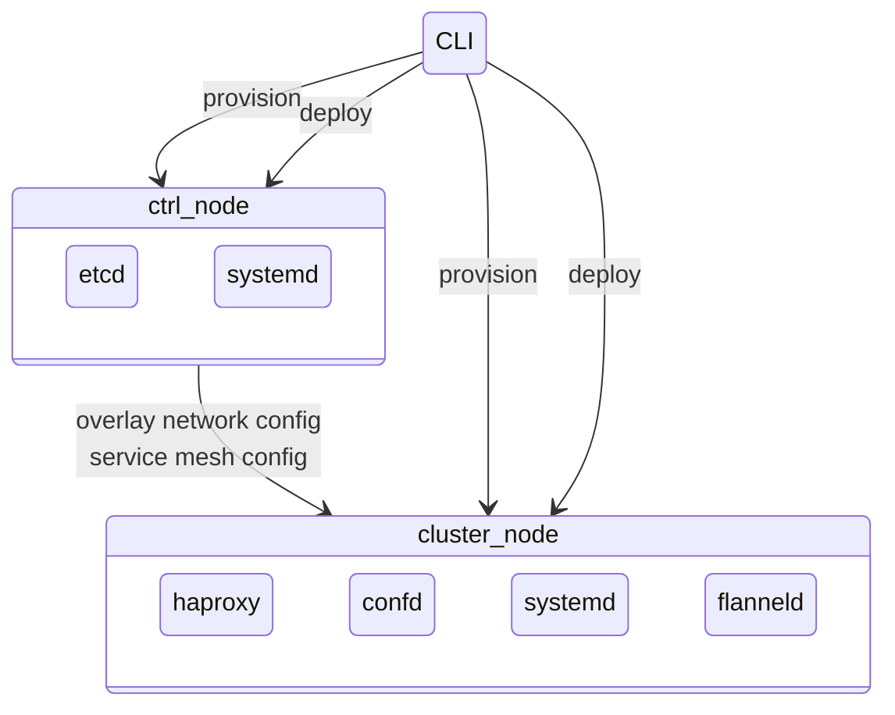
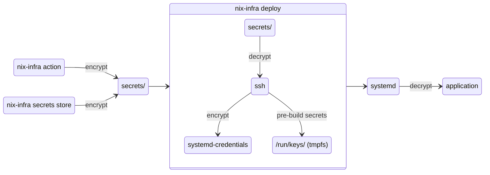
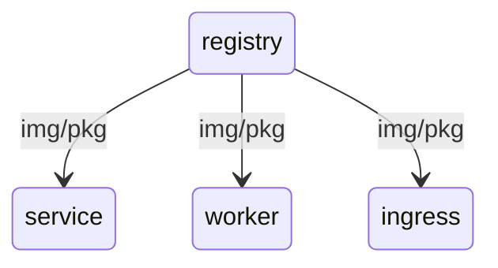
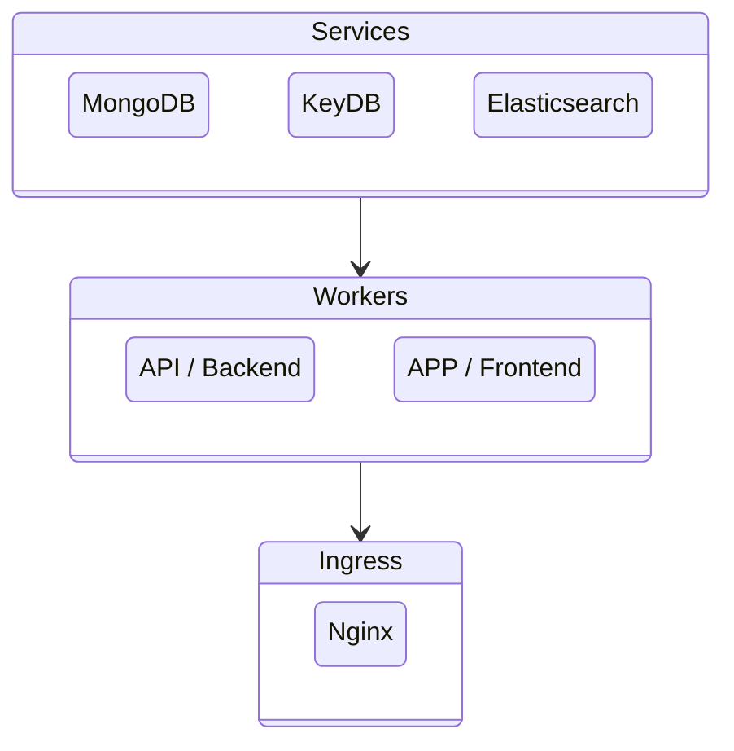

# Architecture

nix-infra is a Dart CLI tool that manages NixOS-based infrastructure. It supports two operational modes: **fleet** (standalone machines managed independently) and **cluster** (high-availability deployments with service mesh and overlay networking). This document explains how the major subsystems work together.

## CLI Structure

The CLI is built with Dart's `args` package and organized into command groups:

```
nix-infra
├── init                    # Initialize a new project (creates config folder, SSH keys, CA)
├── fleet                   # Fleet management (standalone machines)
│   ├── provision           # Create and install NixOS on machines
│   ├── init-machine        # Initialize machine with base config
│   ├── update              # Update machine configuration
│   ├── deploy-apps         # Deploy application configs and secrets
│   ├── destroy             # Destroy machines
│   ├── gc                  # Garbage collect old NixOS generations
│   ├── upgrade-nixos       # Upgrade NixOS version
│   ├── rollback            # Rollback to previous NixOS generation
│   ├── ssh                 # Open SSH session to a machine
│   ├── cmd                 # Run a command on machines
│   ├── port-forward        # Forward a port from a machine
│   ├── action              # Run a remote action script
│   └── upload              # Upload files to machines
├── cluster                 # Cluster management (HA with service mesh)
│   ├── provision           # Create and install NixOS on nodes
│   ├── init-ctrl           # Initialize control plane (etcd)
│   ├── update-ctrl         # Update control plane configuration
│   ├── init-node           # Initialize cluster worker/service nodes
│   ├── update-node         # Update cluster node configuration
│   ├── deploy-apps         # Deploy application configs and secrets
│   ├── destroy             # Unregister and destroy cluster nodes
│   ├── gc                  # Garbage collect old NixOS generations
│   ├── upgrade-nixos       # Upgrade NixOS version
│   ├── rollback            # Rollback to previous NixOS generation
│   ├── ssh                 # Open SSH session to a node
│   ├── cmd                 # Run a command on nodes
│   ├── port-forward        # Forward a port from a node
│   ├── action              # Run a remote action script
│   ├── upload              # Upload files to nodes
│   └── etcd                # Query etcd control plane
├── secrets                 # Secrets management
│   └── store               # Store a secret (from --secret, --secret-file, or stdin)
├── ssh-key                 # SSH key management
│   ├── create              # Create a new SSH key pair
│   └── remove              # Remove SSH key from cloud provider
├── registry                # Container registry management
│   ├── push                # Push container image to registry
│   └── create-cache-key    # Create nix store cache signing key
└── etcd                    # Direct etcd operations
    ├── get                 # Get a value from etcd
    ├── put                 # Put a value in etcd
    └── del                 # Delete a key from etcd
```

Common options shared across command groups:

- `--working-dir` / `-d` — Project directory (default: `.`)
- `--env` — Path to `.env` file
- `--ssh-key` — SSH key name
- `--debug` — Verbose debug logging
- `--batch` — Non-interactive mode (skips confirmations)

## Provider Abstraction

nix-infra uses a provider abstraction layer so the same CLI commands work with different infrastructure backends.

The `InfrastructureProvider` interface defines the contract:

- `getServers()` — List available servers
- `createServer()` — Provision a new server
- `destroyServer()` — Remove a server
- `getIpAddr()` — Look up a server's IP
- `addSshKeyToCloudProvider()` / `removeSshKeyFromCloudProvider()` — Manage SSH keys

Each provider declares its capabilities (`supportsCreateServer`, `supportsDestroyServer`, `supportsPlacementGroups`, `supportsAddSshKey`), allowing the CLI to adapt behavior accordingly.

### Provider Auto-Detection

The `ProviderFactory` automatically selects the right provider:

1. If `servers.yaml` exists in the working directory → **SelfHosting** provider
2. If `HCLOUD_TOKEN` is set in `.env` → **HetznerCloud** provider
3. Otherwise → error

### Hybrid Mode

The SelfHosting provider supports a hybrid mode where some entries in `servers.yaml` reference a cloud provider (e.g., `provider: hetzner`). In this case, the SelfHosting provider delegates IP resolution for those entries to the appropriate cloud provider instance, enabling mixed environments with both self-hosted and cloud-managed servers.

## Provisioning Pipeline

The provisioning pipeline converts a bare server (running any supported Linux distribution) into a NixOS machine:


**Step by step:**

1. **createNodes()** — For cloud providers (HetznerCloud), creates new servers via the API. Handles placement groups for HA. Skips existing nodes.
2. **waitForServers()** — Polls the cloud API until servers report ready. For self-hosted servers, this step is skipped.
3. **installNixos()** — Converts the base OS to NixOS using [nixos-infect](https://github.com/jhsware/nixos-infect). Uploads an install script and a base `configuration.nix` via SFTP, then executes the install over SSH. Supports a `--mutation` option for VMware and other non-standard environments.
4. **waitForSsh()** — Waits for SSH to become available after the server reboots into NixOS.
5. **nixos-rebuild switch** — Runs the initial NixOS rebuild to apply the configuration.

## Configuration Deployment

nix-infra delivers NixOS configuration files to each node via SFTP. The deployment uploads a standard set of files:

- `configuration.nix` — Base system configuration
- `flake.nix` — Nix flake definition (pinned nixpkgs version)
- `cluster_node.nix` or `control_node.nix` — Node type definition
- `modules/` — Shared NixOS modules
- `app_modules/` — Application-specific modules (recursive upload)
- `nodes/<node_name>.nix` — Per-node app configuration

### Variable Substitution

Config files use a placeholder syntax `[%%key%%]` that gets replaced at deploy time. The substitution system supports three types of placeholders:

| Placeholder | Example | Replaced With |
|-------------|---------|---------------|
| Simple variables | `[%%nodeName%%]`, `[%%nixVersion%%]` | The corresponding value from the substitution map |
| Node IP addresses | `[%%worker001.ipv4%%]` | The public IP address of the named node |
| Overlay IPs | `[%%worker001.overlayIp%%]` | The WireGuard overlay IP of the named node (cluster mode) |
| Secrets | `[%%secrets/api-key%%]` | The secret name (file deployed separately via systemd-creds) |
| Pre-build secrets | `[%%pre-build-secrets/github-netrc%%]` | The secret name (deployed decrypted to `/run/keys/` for build-time access) |

The substitution is performed by the `substitute()` function in `lib/helpers.dart`. When a `[%%secrets/...%%]` or `[%%pre-build-secrets/...%%]` placeholder is encountered, the secret name is added to a list of expected secrets that the deployment pipeline then provisions on the target node.

## Service Mesh (Cluster Mode)

In cluster mode, nix-infra sets up a service mesh using etcd, confd, and HAProxy:



**How it works:**

- **etcd** runs on control nodes and stores service registration data (node IPs, service endpoints, ports)
- **confd** watches etcd for changes and regenerates HAProxy configuration templates
- **HAProxy** load-balances traffic between service instances based on the confd-generated config
- When nodes or services are added/removed, `registerClusterNode()` / `unregisterClusterNode()` updates etcd, and confd propagates the changes to HAProxy

### etcd Data Model

```
/cluster/nodes/<node_name>          → { name, ipv4, services[] }
/cluster/frontends/<app>/instances/<node>  → { node, ipv4, port }
/cluster/frontends/<app>/meta_data  → { publish: {port}, env_prefix, env }
/cluster/backends/<app>/instances/<node>   → { node, ipv4, port }
/cluster/backends/<app>/meta_data   → { publish: {port}, env_prefix, env }
/cluster/services/<app>/instances/<node>   → { node, ipv4, port }
/cluster/services/<app>/meta_data   → { publish: {port}, env_prefix, env }
```

Nodes register with the service types they need access to (`services`, `frontends`, `backends`). HAProxy uses the `publish.port` from metadata to expose services on the correct port on each worker node.

## Overlay Network (Cluster Mode)

The cluster uses **Flanneld** with **WireGuard** encryption for the overlay network:

- Flanneld manages subnet allocation, storing subnet-to-node mappings in etcd under `/coreos.com/network/subnets`
- Each node gets a subnet from which overlay IPs are assigned
- WireGuard provides encryption for all inter-node traffic on the overlay
- Overlay IPs are resolved from etcd during deployment and substituted into configuration files via `[%%nodeName.overlayIp%%]`

This allows services to communicate using stable overlay IPs regardless of the underlying network topology or datacenter location.

## Secrets System

Secrets flow through three stages:



1. **Storage** — Secrets are encrypted locally using OpenSSL (`openssl enc -pbkdf2`) with a password and stored in the `secrets/` directory.
2. **Deployment** — During deploy, secrets are decrypted locally, sent over SSH, and re-encrypted on the target using `systemd-creds encrypt` into `/root/secrets/`.
3. **Runtime** — systemd services decrypt secrets at startup using `systemd-creds`.

**Pre-build secrets** follow an additional path: they are also deployed decrypted to `/run/keys/` on tmpfs (mode 0400, root-only) so the Nix daemon can access them during `nixos-rebuild switch`. This solves the chicken-and-egg problem where credentials are needed to fetch packages before the systemd service that manages them exists.

The `syncSecrets()` function ensures only expected secrets exist on each node, removing any that are no longer referenced.

## Certificate Authority

nix-infra creates a local PKI for securing etcd communication:

1. **Root CA** — 4096-bit RSA key, self-signed certificate valid for 20 years
2. **Intermediate CA** — 4096-bit RSA key, signed by root CA, valid for 10 years
3. **Node certificates** — 2048-bit RSA keys signed by intermediate CA, valid for 5 years
   - **Client TLS certificates** — For client-to-etcd authentication
   - **Peer TLS certificates** — For etcd peer-to-peer communication (control nodes only)

The certificate chain (`ca-chain.cert.pem`) is deployed to `/root/certs/` on each node along with the node-specific key and certificate files. etcdctl commands use these certificates for all etcd communication.

Certificates include `subjectAltName` entries with the node's IP address and `127.0.0.1` for local access.

## Container Registry

The registry node provides a private OCI container registry for distributing container images across the cluster:



Nodes can also use a nix store cache with trusted public keys for distributing packages, managed via the `registry create-cache-key` command.

## Service Topology (Cluster Mode)

The cluster uses a three-layer architecture:



- **Services** — Stateful workloads (databases) on dedicated service nodes
- **Workers** — Stateless application containers on worker nodes
- **Ingress** — Nginx reverse proxy exposing the cluster to the internet

## MCP Servers

nix-infra includes three experimental MCP (Model Context Protocol) servers for AI-assisted infrastructure management:

- **nix-infra-cluster-mcp** — Read-only access to cluster infrastructure (node stats, systemd units, journalctl logs, etcd queries)
- **nix-infra-machine-mcp** — Read-only access to standalone machine fleets
- **nix-infra-dev-mcp** — Read/write access for project development (edit app modules, run tests, manage test environments)

The infrastructure MCPs enforce read-only access with command whitelists and blacklists. The dev MCP restricts filesystem access to project directories (`app_modules/`, `modules/`, `node_types/`, `__test__/`).

## Node Lifecycle

1. **Provision** — Create server and install NixOS
2. **Initialize** — Deploy base configuration and node type
3. **Register** — Add node to etcd (cluster mode only)
4. **Deploy** — Push application configurations and secrets
5. **Unregister** — Remove from etcd (cluster mode only)
6. **Destroy** — Destroy the server (cloud providers only)

## App Lifecycle (Cluster Mode)

1. **Register app** — Add app metadata to etcd
2. **Deploy app to node** — Upload app module and node config
3. **Register app instance** — Add instance endpoint to etcd
4. **Unregister app instance** — Remove instance from etcd
5. **Remove app from node** — Remove app configuration
6. **Unregister app** — Remove app metadata from etcd
