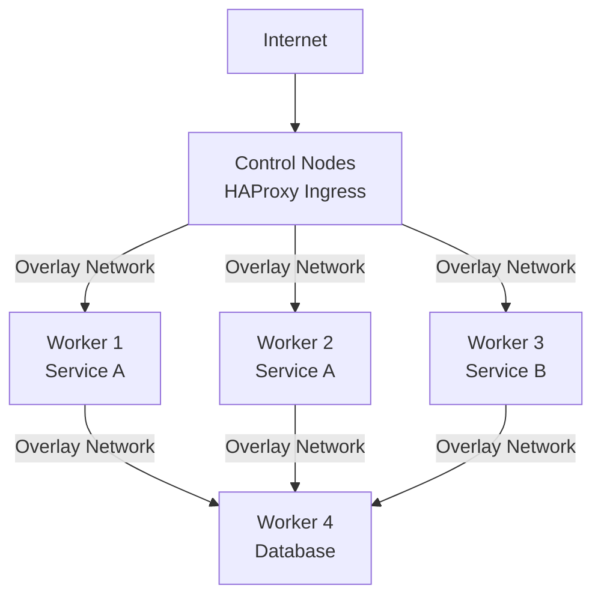

# Cluster Guide

Cluster mode sets up a high-availability infrastructure with an encrypted overlay network, etcd-based service discovery, automatic load balancing, and mutual TLS. It's designed for running distributed services that need to discover each other and handle failover automatically.

## What a Cluster Provides

- **Encrypted overlay network** — Flanneld with WireGuard encryption provides a private network between all nodes, regardless of their physical location
- **Service discovery** — etcd stores service registrations so nodes can find each other dynamically
- **Automatic load balancing** — confd watches etcd and reconfigures HAProxy to route traffic to healthy backends
- **Mutual TLS** — All etcd communication uses certificates from a local certificate authority
- **Ingress routing** — Control nodes run HAProxy as the ingress layer, forwarding external traffic to services on the overlay network

## Prerequisites

Before setting up a cluster, you need:

- The `nix-infra` binary installed
- SSH and OpenSSL available on your workstation
- A provider configured — either a Hetzner Cloud API token (`HCLOUD_TOKEN`) or `servers.yaml` for self-hosted servers (see [Providers](./PROVIDERS.md))
- A `.env` file with your environment variables

## Project Structure

A cluster project typically has this structure (based on the `nix-infra-ha-cluster` template):

```
my-cluster/
├── .env                    # Environment variables
├── configuration.nix       # Base NixOS configuration template
├── flake.nix              # Nix flake for reproducible builds
├── servers.yaml           # Self-hosted server definitions (if applicable)
├── ssh/                   # SSH key pairs (generated by init)
├── ca/                    # Certificate authority (generated by init)
│   ├── certs/             # Root CA certificate
│   ├── private/           # Root CA private key (encrypted)
│   └── intermediate/      # Intermediate CA
│       ├── certs/         # Intermediate CA + chain certificates
│       ├── private/       # Node TLS and peer certificates
│       └── csr/           # Certificate signing requests
├── secrets/               # Encrypted secrets
├── node_types/            # Node module definitions
│   ├── ctrl-node.nix      # Control plane configuration
│   └── worker-node.nix    # Worker node configuration
├── modules/               # Shared NixOS modules
├── app_modules/           # Application configurations
│   └── my-service/
│       ├── default.nix    # App NixOS module
│       └── action.sh      # Operational action script
└── nodes/                 # Per-node configuration overrides
    ├── ctrl-1/
    │   └── apps.nix
    ├── worker-1/
    │   └── apps.nix
    └── worker-2/
        └── apps.nix
```

## Getting Started

### Step 1: Initialize the Project

```bash
nix-infra init --batch
```

This creates SSH keys and a full certificate authority (root CA + intermediate CA) for etcd TLS communication.

Required environment variables:

| Variable | Description |
|----------|-------------|
| `SSH_KEY` | Name for the SSH key pair |
| `SSH_EMAIL` | Email address for the SSH key |
| `CA_PASS` | Password for the root CA private key |
| `INTERMEDIATE_CA_PASS` | Password for the intermediate CA private key |
| `CERT_EMAIL` | Email for certificates |
| `CERT_COUNTRY_CODE` | Country code for certificates (e.g., `SE`) |
| `CERT_STATE_PROVINCE` | State/province for certificates |
| `CERT_COMPANY` | Organization name for certificates |

### Step 2: Provision Nodes

```bash
# Provision control nodes
nix-infra cluster provision \
  --node-names "ctrl-1 ctrl-2 ctrl-3" \
  --nixos-version 24.11 \
  --machine-type cx22 \
  --location fsn1 \
  --placement-group ctrl-spread

# Provision worker nodes
nix-infra cluster provision \
  --node-names "worker-1 worker-2" \
  --nixos-version 24.11 \
  --machine-type cx32 \
  --location fsn1
```

This creates cloud servers, waits for them to be ready, and converts them to NixOS via nixos-infect. The provisioning process includes retry logic — if a node fails to convert to NixOS, it will retry up to 3 times.

| Parameter | Required | Description |
|-----------|----------|-------------|
| `--node-names` | Yes | Space-separated list of node names |
| `--nixos-version` | Yes | NixOS version to install (e.g., `24.11`) |
| `--machine-type` | Yes* | Server type (e.g., `cx22`) |
| `--location` | Yes* | Data center location (e.g., `fsn1`) |
| `--placement-group` | No | Place nodes in a spread group (Hetzner Cloud only) |
| `--mutation` | No | Use a nixos-infect mutation for non-standard OS |

*Required for cloud providers; ignored for self-hosted servers.

### Step 3: Initialize Control Plane

```bash
nix-infra cluster init-ctrl \
  --target "ctrl-1 ctrl-2 ctrl-3" \
  --nixos-version 24.11 \
  --cluster-uuid my-cluster-01
```

This is a multi-step process that:

1. Generates TLS and peer certificates for each control node
2. Deploys certificates to `/root/certs/` on each node
3. Deploys the control node configuration (etcd, Flanneld, confd, HAProxy)
4. Runs `nixos-rebuild switch` to apply the configuration

The `--cluster-uuid` is a unique identifier for the etcd cluster. Use a consistent value across all control nodes in the same cluster.

| Parameter | Required | Description |
|-----------|----------|-------------|
| `--target` | Yes | Space-separated list of control node names |
| `--nixos-version` | Yes | NixOS version |
| `--cluster-uuid` | Yes | Unique cluster identifier for etcd |

### Step 4: Initialize Worker Nodes

```bash
nix-infra cluster init-node \
  --target "worker-1 worker-2" \
  --ctrl-nodes "ctrl-1 ctrl-2 ctrl-3" \
  --node-module worker-node \
  --service-group "web database" \
  --nixos-version 24.11
```

This:

1. Generates TLS certificates for each worker node (client certificates only, no peer certs needed)
2. Deploys certificates to the node
3. Deploys the cluster node configuration with etcd endpoints pointing to the control nodes
4. Deploys application configurations from `app_modules/`
5. Runs `nixos-rebuild switch`
6. Triggers confd to update HAProxy configuration
7. Registers the node with etcd (stores node metadata and service group information)

| Parameter | Required | Description |
|-----------|----------|-------------|
| `--target` | Yes | Space-separated list of worker node names |
| `--ctrl-nodes` | No | Control node names (defaults to `CTRL_NODES` env var) |
| `--node-module` | Yes | Node type from `node_types/` |
| `--service-group` | No | Space-separated service groups this node belongs to |
| `--nixos-version` | Yes | NixOS version |

### Step 5: Deploy Applications

```bash
nix-infra cluster deploy-apps \
  --target "worker-1 worker-2"
```

Deploys or updates application configurations on target nodes. In cluster mode, secrets are deployed using overlay network IPs and variable substitutions include overlay addresses.

| Parameter | Required | Description |
|-----------|----------|-------------|
| `--target` | Yes | Space-separated list of target nodes |
| `--test-dir` | No | Alternative directory for app configurations |
| `--rebuild` | No | Run `nixos-rebuild` after deploying (default: `false`) |

## Day-2 Operations

### Update Control Nodes

```bash
nix-infra cluster update-ctrl \
  --target "ctrl-1 ctrl-2 ctrl-3" \
  --nixos-version 24.11 \
  --cluster-uuid my-cluster-01 \
  --rebuild
```

Updates the control plane configuration without regenerating certificates.

### Update Worker Nodes

```bash
nix-infra cluster update-node \
  --target "worker-1" \
  --ctrl-nodes "ctrl-1 ctrl-2 ctrl-3" \
  --node-module worker-node \
  --nixos-version 24.11 \
  --rebuild
```

Updates a worker node's base configuration. Use `--rebuild` to trigger `nixos-rebuild switch` and a confd update immediately.

### Destroy Nodes

```bash
nix-infra cluster destroy \
  --target "worker-2" \
  --ctrl-nodes "ctrl-1 ctrl-2 ctrl-3"
```

For cloud-provisioned nodes, this unregisters the node from etcd and destroys the server. For self-hosted servers, it unregisters from etcd only — you must remove the server from `servers.yaml` manually.

### Upgrade NixOS

```bash
nix-infra cluster upgrade-nixos \
  --target "worker-1" \
  --nixos-version 25.05
```

Performs a NixOS version upgrade. For major version changes, this updates the nix channel and configuration before rebuilding.

### Rollback

```bash
nix-infra cluster rollback --target "worker-1"
```

Rolls back to the previous NixOS configuration using `nixos-rebuild switch --rollback`.

### Garbage Collect

```bash
nix-infra cluster gc --target "worker-1 worker-2"
```

Runs `nix-collect-garbage -d` to free disk space. **Warning:** This clears rollback history.

### SSH Access

```bash
# Interactive shell
nix-infra cluster ssh --target "worker-1"

# Run a command on multiple nodes
nix-infra cluster cmd --target "worker-1 worker-2" -- systemctl status etcd
```

### Port Forwarding

```bash
nix-infra cluster port-forward \
  --target "worker-1" \
  --local-port 5432 \
  --remote-port 5432
```

Forwards a remote port to your local machine. In cluster mode, port forwarding uses the overlay network, so you can reach services on internal overlay IPs.

### Run Action Scripts

```bash
nix-infra cluster action \
  --target "worker-1" \
  --app-module my-service \
  --cmd migrate \
  --env-vars "DB_HOST=[%%db-1.overlayIp%%]"
```

Action scripts in cluster mode have access to overlay IP variable substitutions (`[%%<node>.overlayIp%%]`), making it easy to reference other nodes by their overlay addresses.

The `--save-as-secret` option captures the action output and stores it as an encrypted secret.

### Upload Files

```bash
nix-infra cluster upload \
  --target "worker-1" \
  --file "./data/config.json" \
  --remote-path /root/uploads
```

Uploads files or directories to target nodes via SFTP.

## etcd Management

nix-infra provides convenience commands for inspecting the etcd cluster state. All etcd commands require `--target` pointing to a control node.

### Direct etcdctl Access

```bash
nix-infra cluster etcd ctl \
  --target "ctrl-1" \
  -- get / --prefix --keys-only
```

Runs any `etcdctl` command with the correct TLS configuration (certificates, API version, timeouts) automatically set up.

### List Registered Nodes

```bash
nix-infra cluster etcd nodes --target "ctrl-1"
```

Shows all nodes registered under `/cluster/nodes` in etcd.

### List Services

```bash
nix-infra cluster etcd services --target "ctrl-1"
```

Shows all services registered under `/cluster/services` in etcd.

### List Backends

```bash
nix-infra cluster etcd backends --target "ctrl-1"
```

Shows HAProxy backend configurations under `/cluster/backends` in etcd.

### List Frontends

```bash
nix-infra cluster etcd frontends --target "ctrl-1"
```

Shows HAProxy frontend configurations under `/cluster/frontends` in etcd.

### Show Network

```bash
nix-infra cluster etcd network --target "ctrl-1"
```

Shows Flanneld overlay network configuration under `/coreos.com` in etcd, including subnet allocations.

## etcd Data Model

The cluster stores its state in etcd using the following key structure:

```
/cluster/
├── nodes/<node-name>          # Node registrations with metadata
├── services/<service-name>    # Service definitions
├── backends/<service>/...     # HAProxy backend configurations
└── frontends/<service>/...    # HAProxy frontend configurations

/coreos.com/
└── network/                   # Flanneld overlay network configuration
    └── subnets/               # Per-node subnet allocations
```

confd watches these keys and regenerates HAProxy configuration when changes are detected. This means adding or removing a node automatically updates the load balancer.

## Container Registry

The cluster can host a private container registry for distributing OCI images.

### Publish an Image

```bash
nix-infra registry publish-image \
  --target "ctrl-1" \
  --file ./result \
  --image-name my-app \
  --image-tag v1.2.3
```

Uploads a container image to the registry running on the target node.

| Parameter | Required | Description |
|-----------|----------|-------------|
| `--target` | Yes | Node hosting the registry |
| `--file` | Yes | Path to the image file |
| `--image-name` | Yes | Name for the image |
| `--image-tag` | Yes | Tag for the image (e.g., version) |
| `--use-localhost` | No | Registry listens on localhost (default: `false`) |

### List Images

```bash
nix-infra registry list-images --target "ctrl-1"
```

Lists all images available in the registry.

## Service Topology

Traffic flows through the cluster in layers:



1. **Ingress layer** — Control nodes run HAProxy, which is the only layer exposed to the internet. HAProxy terminates external connections and forwards traffic to backends on the overlay network.
2. **Service layer** — Worker nodes run application services. They register with etcd so HAProxy knows where to route traffic. Services communicate with each other over overlay IPs.
3. **Data layer** — Database and storage services run on the overlay network, accessible only from other cluster nodes.

confd continuously watches etcd and regenerates HAProxy configuration, so adding or removing a worker node automatically updates routing.

## Variable Substitutions in Cluster Mode

Cluster mode adds overlay network substitutions beyond what fleet mode provides:

| Placeholder | Resolves To |
|-------------|-------------|
| `[%%<node>.ipv4%%]` | Node's public IP address |
| `[%%<node>.overlayIp%%]` | Node's overlay network IP (from Flanneld/etcd) |
| `[%%localhost.hostname%%]` | Current node's hostname |
| `[%%localhost.ipv4%%]` | Current node's public IP |
| `[%%localhost.overlayIp%%]` | Current node's overlay IP |
| `[%%secrets/<name>%%]` | Decrypted secret value |
| `[%%pre-build-secrets/<name>%%]` | Pre-build secret reference |

These substitutions are applied when deploying configuration files and secrets to nodes.

## Global Options

These options are available on all cluster subcommands:

| Option | Description |
|--------|-------------|
| `--working-dir`, `-d` | Working directory (default: `.`) |
| `--ssh-key` | SSH key name (overrides `SSH_KEY` from `.env`) |
| `--env` | Path to `.env` file |
| `--debug` | Enable verbose debug logging |
| `--batch` | Run non-interactively (skip confirmation prompts) |

## MCP Integration

For AI-assisted cluster management, nix-infra provides an MCP server that exposes cluster operations as tools. You can launch it with `./cli claude` from the cluster project directory. See [Security — MCP Server Safety](./SECURITY.md#mcp-server-safety) for the safety restrictions that apply to MCP-driven operations.
